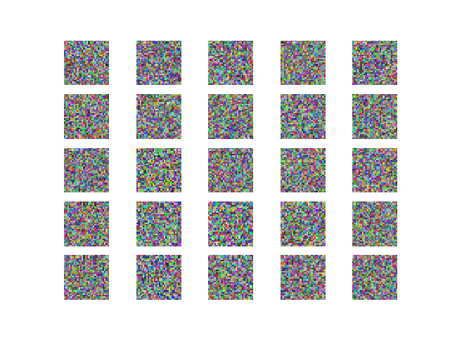

# Keras-GAN

## About
Keras implementations of Generative Adversarial Networks (GANs) suggested in research papers. If dense layers produce reasonable results for a given model I will often prefer them over convolutional layers. The reason is that I would like to enable people without GPUs to test these implementations out. These models are in some cases simplified versions of the ones ultimately described in the papers, but I have chosen to focus on getting the core ideas covered instead of getting every layer configuration right. However, because of this the results will not always be as nice as in the papers.

## Table of Contents
- [Keras-GAN](#keras-gan)
  * [About](#about)
  * [Table of Contents](#table-of-contents)
  * [Installation](#installation)
  * [Implementations](#implementations)
    + [Auxiliary Classifier GAN](#ac-gan)
    + [Adversarial Autoencoder](#adversarial-autoencoder)
    + [Bidirectional GAN](#bigan)
    + [Boundary-Seeking GAN](#bgan)
    + [Conditional GAN](#cgan)
    + [Context-Conditional GAN](#cc-gan)
    + [Context Encoder](#context-encoder)
    + [Coupled GANs](#cogan)
    + [CycleGAN](#cyclegan)
    + [Deep Convolutional GAN](#dcgan)
    + [DiscoGAN](#discogan)
    + [DualGAN](#dualgan)
    + [Generative Adversarial Network](#gan)
    + [Improved Wasserstein GAN](#improved-wgan)
    + [InfoGAN](#infogan)
    + [LSGAN](#lsgan)
    + [Pix2Pix](#pix2pix)
    + [PixelDA](#pixelda)
    + [Semi-Supervised GAN](#sgan)
    + [Super-Resolution GAN](#srgan)
    + [Wasserstein GAN](#wgan)

## Installation
    $ git clone https://github.com/eriklindernoren/Keras-GAN
    $ cd Keras-GAN/
    $ sudo pip3 install -r requirements.txt

## Implementations   
### AC-GAN
Implementation of Auxiliary Classifier Generative Adversarial Network.

[Code](acgan/acgan.py)

Paper: https://arxiv.org/abs/1610.09585

#### Example
```
$ cd acgan/
$ python3 acgan.py
```

<p align="center">
    
</p>

### Adversarial Autoencoder
Implementation of Adversarial Autoencoder.

[Code](aae/adversarial_autoencoder.py)

Paper: https://arxiv.org/abs/1511.05644

#### Example
```
$ cd aae/
$ python3 aae.py
```

<p align="center">
    
</p>

### BiGAN
Implementation of Bidirectional Generative Adversarial Network.

[Code](bigan/bigan.py)

Paper: https://arxiv.org/abs/1605.09782

#### Example
```
$ cd bigan/
$ python3 bigan.py
```

### BGAN
Implementation of Boundary-Seeking Generative Adversarial Networks.

[Code](bgan/bgan.py)

Paper: https://arxiv.org/abs/1702.08431

#### Example
```
$ cd bgan/
$ python3 bgan.py
```

### CC-GAN
Implementation of Semi-Supervised Learning with Context-Conditional Generative Adversarial Networks.

[Code](ccgan/ccgan.py)

Paper: https://arxiv.org/abs/1611.06430

#### Example
```
$ cd ccgan/
$ python3 ccgan.py
```

<p align="center">
    
</p>

### CGAN
Implementation of Conditional Generative Adversarial Nets.

[Code](cgan/cgan.py)

Paper:https://arxiv.org/abs/1411.1784

#### Example
```
$ cd cgan/
$ python3 cgan.py
```

<p align="center">
    
</p>

### Context Encoder
Implementation of Context Encoders: Feature Learning by Inpainting.

[Code](context_encoder/context_encoder.py)

Paper: https://arxiv.org/abs/1604.07379

#### Example
```
$ cd context_encoder/
$ python3 context_encoder.py
```

<p align="center">
    
</p>

### CoGAN
Implementation of Coupled generative adversarial networks.

[Code](cogan/cogan.py)

Paper: https://arxiv.org/abs/1606.07536

#### Example
```
$ cd cogan/
$ python3 cogan.py
```

### CycleGAN
Implementation of Unpaired Image-to-Image Translation using Cycle-Consistent Adversarial Networks.

[Code](cyclegan/cyclegan.py)

Paper: https://arxiv.org/abs/1703.10593

<p align="center">
    
</p>

#### Example
```
$ cd cyclegan/
$ bash download_dataset.sh apple2orange
$ python3 cyclegan.py
```   

<p align="center">
    
</p>


### DCGAN
Implementation of Deep Convolutional Generative Adversarial Network.

[Code](dcgan/dcgan.py)

Paper: https://arxiv.org/abs/1511.06434

#### Example
```
$ cd dcgan/
$ python3 dcgan.py
```

<p align="center">
    
</p>

### DiscoGAN
Implementation of Learning to Discover Cross-Domain Relations with Generative Adversarial Networks.

[Code](discogan/discogan.py)

Paper: https://arxiv.org/abs/1703.05192

<p align="center">
    
</p>

#### Example
```
$ cd discogan/
$ bash download_dataset.sh edges2shoes
$ python3 discogan.py
```   

<p align="center">
    
</p>

### DualGAN
Implementation of DualGAN: Unsupervised Dual Learning for Image-to-Image Translation.

[Code](dualgan/dualgan.py)

Paper: https://arxiv.org/abs/1704.02510

#### Example
```
$ cd dualgan/
$ python3 dualgan.py
```

### GAN
Implementation of Generative Adversarial Network with a MLP generator and discriminator.

[Code](gan/gan.py)

Paper: https://arxiv.org/abs/1406.2661

#### Example
```
$ cd gan/
$ python3 gan.py
```

<p align="center">
    
</p>

GAN on RGB face images
[Code](gan/gan_rgb.py)

#### Example
```
$ cd gan/
<follow steps at the top of gan_rgb.py>
$ python3 gan_rgb.py
```

<p align="center">
    
</p>

### Improved WGAN
Implementation of Improved Training of Wasserstein GANs.

[Code](improved_wgan/improved_wgan.py)

Paper: https://arxiv.org/abs/1704.00028

#### Example
```
$ cd improved_wgan/
$ python3 improved_wgan.py
```

<p align="center">
    
</p>

### InfoGAN
Implementation of InfoGAN: Interpretable Representation Learning by Information Maximizing Generative Adversarial Nets.

[Code](infogan/infogan.py)

Paper: https://arxiv.org/abs/1606.03657

#### Example
```
$ cd infogan/
$ python3 infogan.py
```

<p align="center">
    
</p>

### LSGAN
Implementation of Least Squares Generative Adversarial Networks.

[Code](lsgan/lsgan.py)

Paper: https://arxiv.org/abs/1611.04076

#### Example
```
$ cd lsgan/
$ python3 lsgan.py
```

### Pix2Pix
Implementation of Unpaired Image-to-Image Translation with Conditional Adversarial Networks.

[Code](pix2pix/pix2pix.py)

Paper: https://arxiv.org/abs/1611.07004

<p align="center">
    
</p>

#### Example
```
$ cd pix2pix/
$ bash download_dataset.sh facades
$ python3 pix2pix.py
```   

<p align="center">
    
</p>

### PixelDA
Implementation of Unsupervised Pixel-Level Domain Adaptation with Generative Adversarial Networks.

[Code](pixelda/pixelda.py)

Paper: https://arxiv.org/abs/1612.05424

#### MNIST to MNIST-M Classification
Trains a classifier on MNIST images that are translated to resemble MNIST-M (by performing unsupervised image-to-image domain adaptation). This model is compared to the naive solution of training a classifier on MNIST and evaluating it on MNIST-M. The naive model manages a 55% classification accuracy on MNIST-M while the one trained during domain adaptation gets a 95% classification accuracy.

```
$ cd pixelda/
$ python3 pixelda.py
```

| Method       | Accuracy  |
| ------------ |:---------:|
| Naive        | 55%       |
| PixelDA      | 95%       |

### SGAN
Implementation of Semi-Supervised Generative Adversarial Network.

[Code](sgan/sgan.py)

Paper: https://arxiv.org/abs/1606.01583

#### Example
```
$ cd sgan/
$ python3 sgan.py
```

<p align="center">
    
</p>

### SRGAN
Implementation of Photo-Realistic Single Image Super-Resolution Using a Generative Adversarial Network.

[Code](srgan/srgan.py)

Paper: https://arxiv.org/abs/1609.04802

<p align="center">
    
</p>


#### Example
```
$ cd srgan/
<follow steps at the top of srgan.py>
$ python3 srgan.py
```

<p align="center">
    
</p>

### WGAN
Implementation of Wasserstein GAN (with DCGAN generator and discriminator).

[Code](wgan/wgan.py)

Paper: https://arxiv.org/abs/1701.07875

#### Example
```
$ cd wgan/
$ python3 wgan.py
```

<p align="center">
    
</p>
